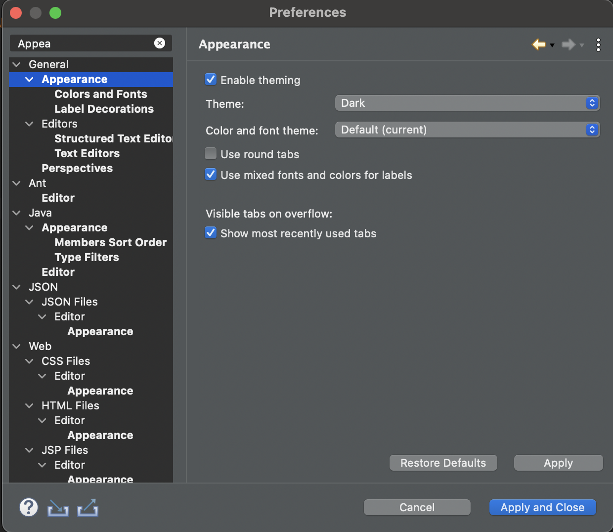
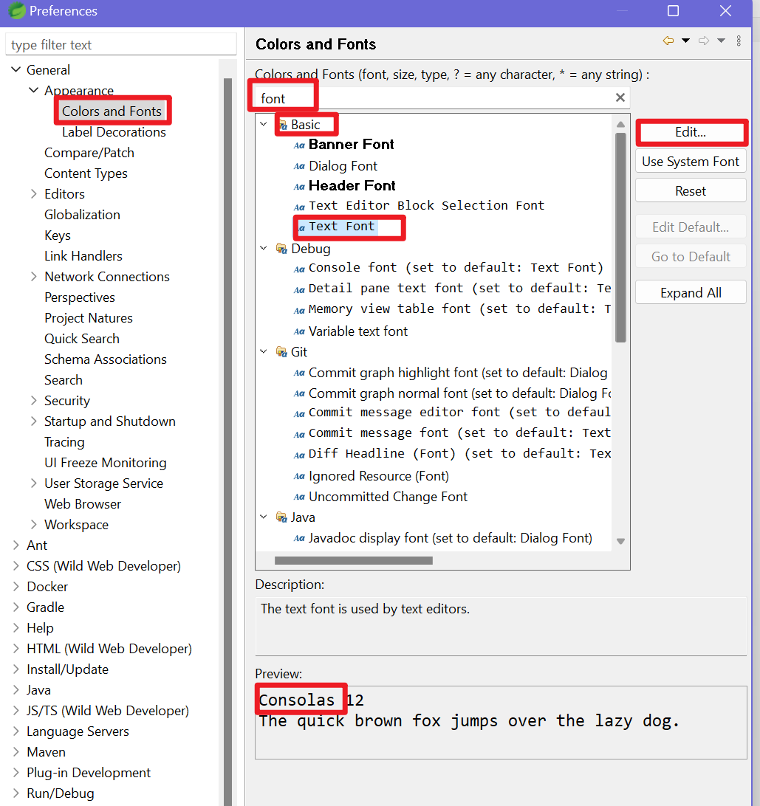
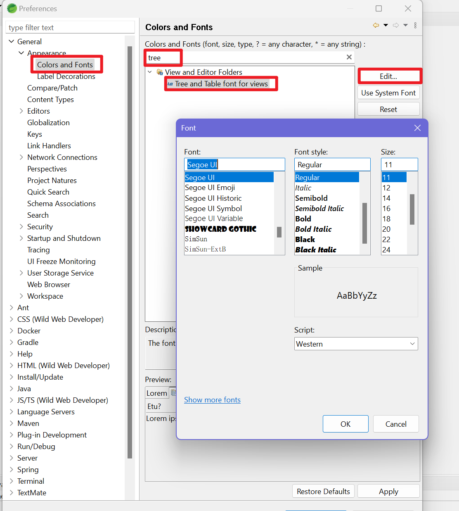
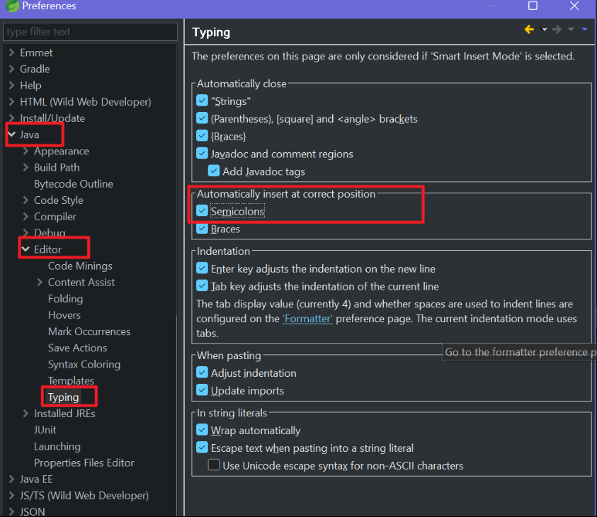
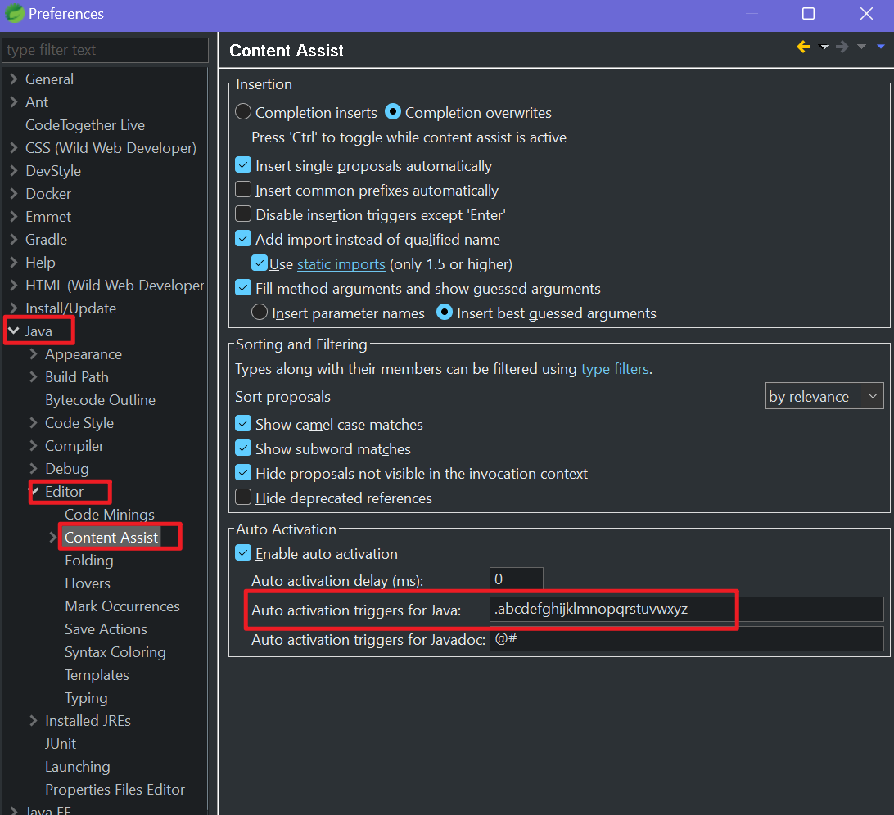
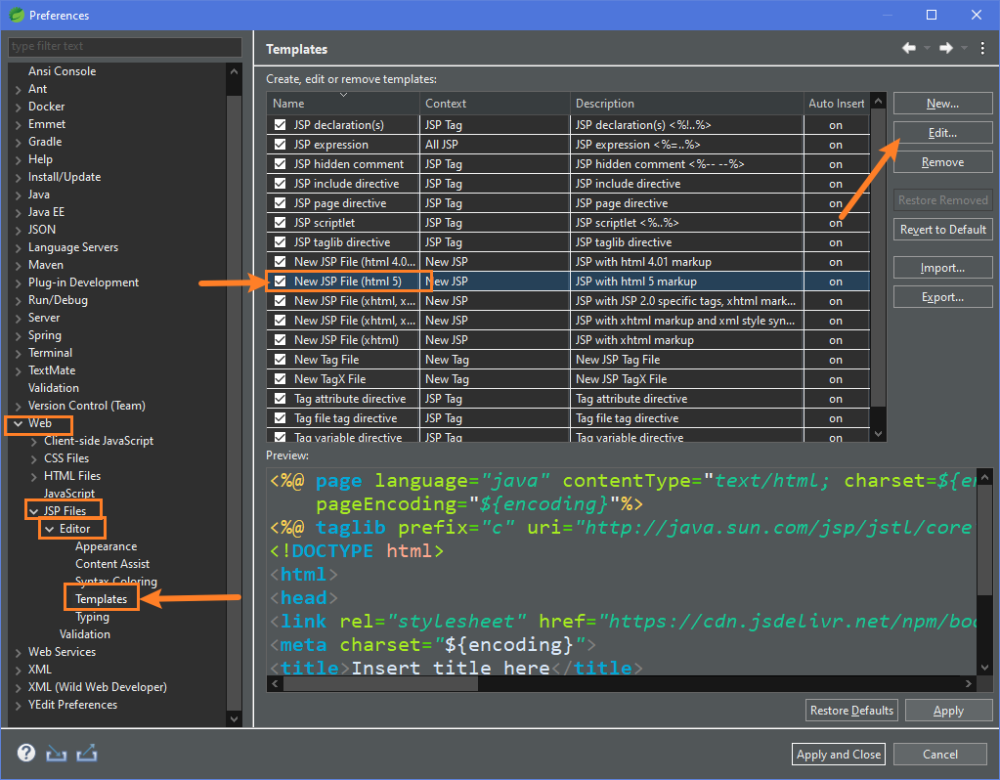

### Spring project folder structures
- Explore the files we need to look at . 
  | DIRECTORY | FILENAME | DESCRIPTION |
  |---------|--------| -------|
  | root directory     |POM.XML| SETUP: To store all required dependencies, click on pom.xml to manually add dependencies in|
  | src/main/resources | application.properties  | CONFIG : To add configurations like MySQL connection, any default file prefix/suffix |
  | |static folder| For images, css, js | 
  |src/main/java| | This package/folder includes all the necessary controller, models etc. We will create subpackages in this folder|
  |  | FirstDemoApplication.java | main method like the entry point. But putting everything here will be messy. |
 

 ### Different settings
- Dark mode
    {width=300}

- Update Text size
    

- Update Workspace size
    

- Automation
    
    

- jsp template
    

